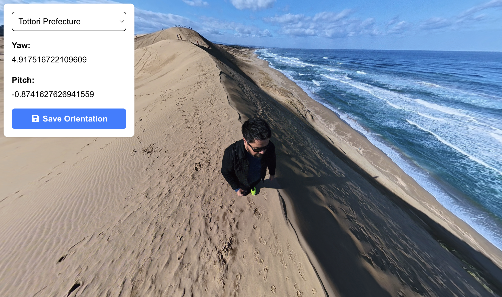

# Japan 360

360° photo gallery exploring Japan's 47 prefectures, captured while living in Japan.

## Demo

[https://japan-360.vercel.app/](https://japan-360.vercel.app/)



## Viewer Events

These custom events are handled by the 360 viewer:

- Syncs state with updated coordinates when the user drags the image.
- Animates image from default position to database coordinates.
- Controls menu visibility, as it should not render during the 360 loading state.

```js
// Sync coordinates.
viewerInstance.addEventListener(events.PositionUpdatedEvent.type,
  (position) => {
    updateObject(selectedPrefecture, {...});
  },
);

// Animate on ready.
viewerInstance.addEventListener(events.ReadyEvent.type,
async () => {
  await viewerInstance.animate({...});
});

// Show menu on ready.
viewerInstance.addEventListener(events.ReadyEvent.type,
  () => {
    setIsViewerReady(...);
  }
);
```

## Tech Stack

- Next.js
- TypeScript
- Photo Sphere Viewer
- Tailwind CSS

## ENV

```bash
NEXT_PUBLIC_IMAGES_URL=
NEXT_PUBLIC_GA_ID=
NEXT_PUBLIC_ENVIRONMENT=
```

## Run

```bash
npm install
npm run dev
```

## Author

Jorge Donoso

## License

MIT
